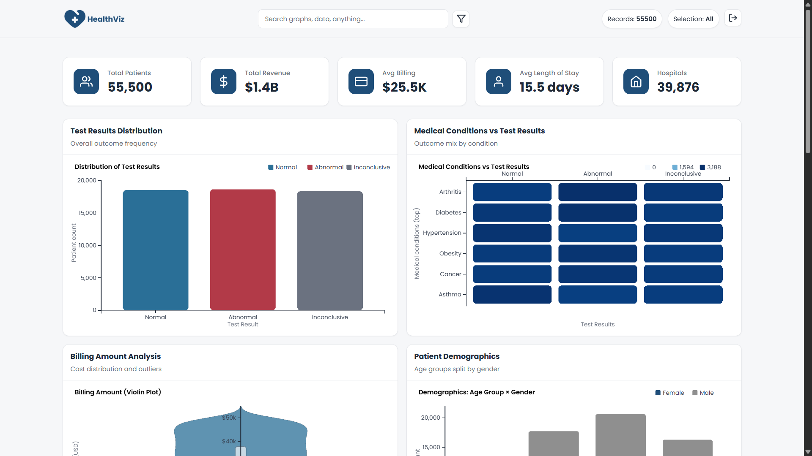
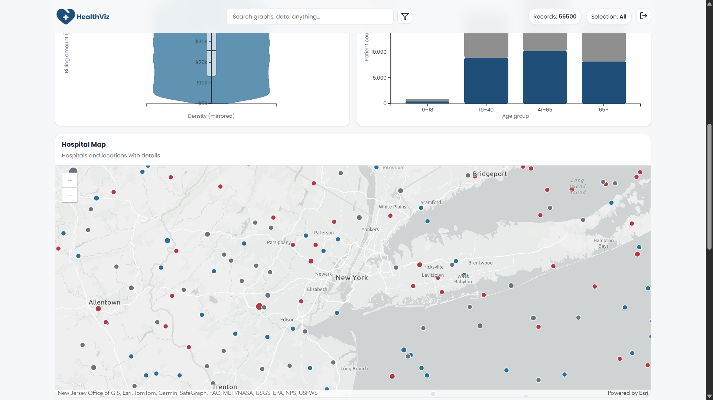
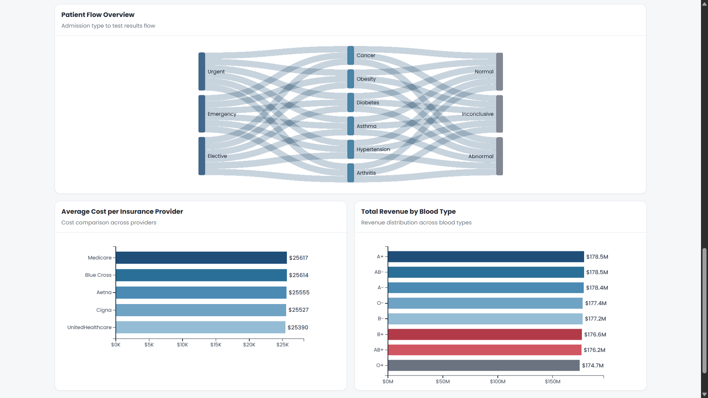
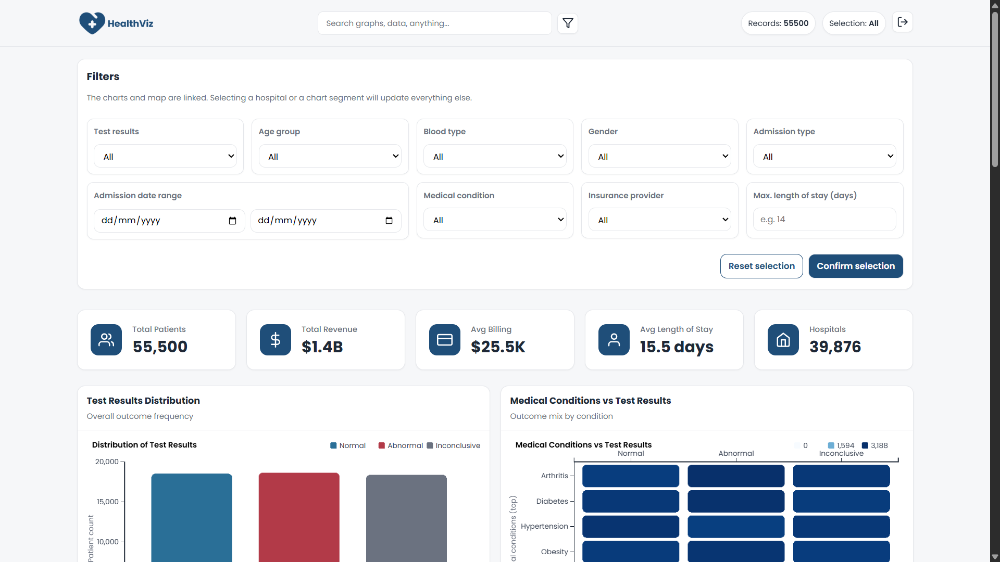
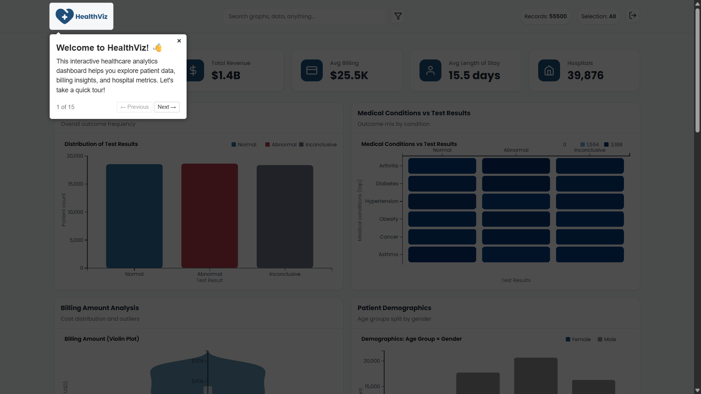
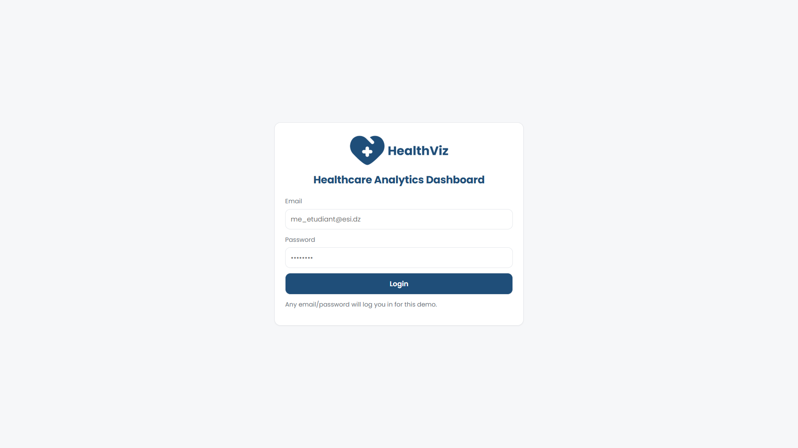

# HealthViz

An interactive, client-side dashboard for exploring hospital and patient analytics. It visualizes KPIs, demographics, medical conditions, test results, insurance costs, and revenue, with an interactive hospital map. Built with vanilla JavaScript, D3.js, and the ArcGIS JavaScript API.

## Features

### **KPIs & Overview**
- Key metrics with fast updates (patients, revenue, LOS, etc.)
- Optimized aggregations and DOM updates for responsiveness

### **Charts**
- **Donut Chart**: Test Results Distribution (Normal/Abnormal/Inconclusive)
- **Donut Chart**: Total Revenue by Blood Type
- **Line Chart**: Average Cost per Insurance Provider (with area fill)
- **Stacked Bar Chart**: Medical Conditions by Test Result
- **Stacked Bar Chart**: Patient Demographics (Age × Gender)
- **Violin Plot**: Billing Amount Distribution
- **Sankey Diagram**: Patient Flow (Admission → Condition → Result)

### **Interactive Map**
- ArcGIS-based hospital map with hover details
- Debounced/throttled interactions to keep the UI smooth

### **Performance**
- Cached filters and hospital stats
- Lazy chart updates via IntersectionObserver
- Debouncing and requestAnimationFrame batching

### **Guided Tutorial**
- Optional driver.js onboarding with a short delay

## Screenshots

**Dashboard Overview**






**Search & Filtering**


**Tutorial Onboarding**


**Login Page**


## Tech Stack

- **JavaScript** for logic
- **D3.js v7** for charts
- **ArcGIS API 4** for the map
- **driver.js** for tutorial
- **CSS** for layout and theme

## Project Structure

```
HealthViz/
├── index.html
├── README.md
├── css/
│   └── styles.css
├── data/
│   └── healthcare_dataset.csv
├── js/
│   ├── charts.js
│   ├── data.js
│   ├── main.js
│   ├── map.js
│   ├── state.js
│   ├── charts/
│   │   ├── billing.js
│   │   ├── conditions.js
│   │   ├── demographics.js
│   │   ├── patientFlow.js
│   │   └── testResults.js
│   └── utils/
│       ├── format.js
│       ├── geo.js
│       ├── stats.js
│       └── tooltip.js
```

## Getting Started

### Prerequisites
- Node.js (recommended) for serving files locally

### Run Locally

Use any static file server. Options:

1. With `serve` (recommended)
   ```bash
   npx serve -l 3000
   ```
   If that fails, install globally:
   ```bash
   npm install -g serve
   serve -l 3000
   ```

2. With `http-server`
   ```bash
   npx http-server -p 3000
   ```

3. VS Code Live Server extension
- Open the folder and click "Go Live" (default port varies)

Then visit: http://localhost:3000

## Configuration

- Theme colors are defined in [css/styles.css](css/styles.css)
- Palette and app config live in [js/state.js](js/state.js)
- Data is loaded from [data/healthcare_dataset.csv](data/healthcare_dataset.csv)

You can replace the CSV with your own dataset (matching expected column names such as hospital, medical condition, test result, insurance provider, blood type, age group, gender, revenue/cost as used by the charts).

## Usage

- Use the filters in the UI to focus on hospitals, conditions, and results
- Hover on bars and map features for tooltips
- Charts update lazily when they become visible for performance
- Start the tutorial from the help menu (or on first load)

## Development Notes

- Charts are coordinated via [js/charts.js](js/charts.js) and individual chart modules under [js/charts](js/charts)
- Data filtering/caching lives in [js/data.js](js/data.js)
- Map logic and throttling are in [js/map.js](js/map.js)
- Utility helpers are under [js/utils](js/utils)

## Troubleshooting

- Blank page or missing data: ensure you are serving over HTTP; opening the HTML via `file://` can break module imports and CSV loading.
- `npx serve` fails: try `npm install -g serve` and run `serve -l 3000`, or use `npx http-server -p 3000`, or Live Server in VS Code.
- Slow updates: large datasets may benefit from reducing visible charts; lazy loading helps automatically.

## License

This project is licensed under the MIT License. See the [LICENSE](LICENSE) file for details.
